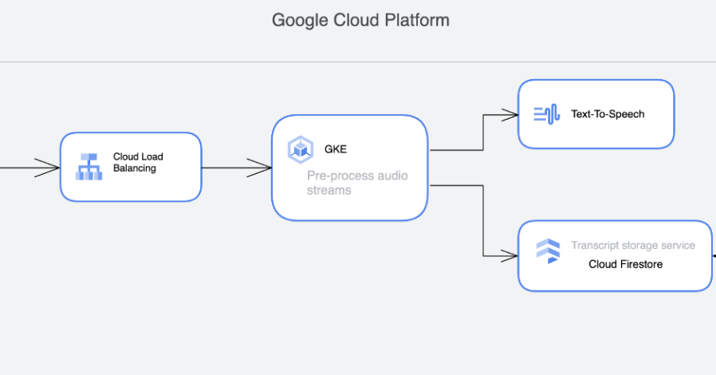

# Speech-To-Text Service 

**Note**: This is a privately owned repository. Google or Google Cloud does not either endorse or take responsibility for the contents of this repository.




_Figure: Architecture of the proposed solution. The *STT-Proxy* server is hosted on the GKE cluster_

## Getting started

1. Clone this repo.

   ```bash
   git clone 
   cd SpeechToText
   ```

1. Define your GCP project ID.

   ```bash
   export PROJECT_ID=<YOUR PROJECT ID>
   ```

1. Kick off build of infrastructure. This process also builds the image of the *stt-proxy server*. Please submit the tag of the built image, or *v0* will be used. 

   ```bash
   ./build.sh --build --tag v1
   ```
> Cloud build will be used to deploy the infrastructure and build the images. The individual files that configure this can be found in the */builds* folder.
> The terraform modules that define the infrastructure are stored in *infra/terraform* folder.
> The helm charts used to deploy the *stt-proxy service* are stored in *infra/k8s* folder.

1. View build in the Console.

   ```bash
   https://console.cloud.google.com/cloud-build
   ```

   > This step can take around 20 minutes to complete.

## What infrastructure is deployed

This creates the infrastructure displayed in the figure. 
1. A Virtual private Cloud with subnets for the GKE cluster
1. A GKE Autopilot cluster
1. A Firestore database
1. Artifact registry to store container images
1. Service accounts for the proxy service that will run in the GKE cluster.

## What are the custom services used.
The code repo also contains an *STT_Proxy* sever and a *Client*.  They can be found in *cmd/server* and *cmd/client* respectively.
The client reads audio files from the local computer and forwards them to the server. The server asynchronously sends audio data to the Google Cloud's Speech-to-Text service. The recieved transcripts are stored in the Firebase db.
The server and client communicate through GRPC and the protobuf definitions are found in the *proto* folder.

A single dockerfile that is used build both the client and server is found in *builds/docker*. Both services share the same dockerfile but are invoked by the command 'server' and 'client'.

### STT_PROXY server
Hosts the GRPC STT server. The following environment variables are required.
1. PROJECT_ID: The GCP project id.
1. LANGUAGE_CODE: Defaults to 'en-US'
1. DBNAME: The Firestore database storing the transcripts
1. AUDIO_RATE: The audio rate of the audio sent.
1. PORT: The port at which this service is exposed. Defaults to 8081

### Client 
Hosts the GRPC client service. The following environment variables are required.
1. AUDIO_PATH: The local path of the audiofile to transcribe.
1. SERVER_ADDR: The address of the STT-Proxy server. In the format "hostname:PORT"

The client can be run locally by using the docker-compose.yaml file. The required environment variables need to be passed to the docker-compose file.

## TODO

1. Cloud Deploy for the Helm chart.
1. TLS
1. Horzontal pod autoscaler
1. Integration with Cloud Operations
1. Implement destroy
1. Implement cloud endpoints
1. Implement other security

